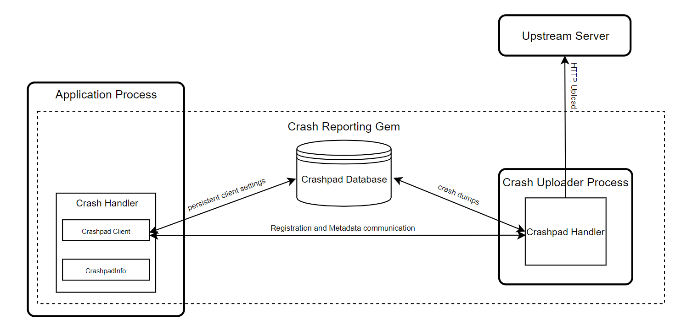

### Summary:
Enables O3DE developers to quickly and easily get up to speed with collecting crash reporting for their projects. Individual crash reports enables developers to understand where there are issues, but combined with a service and metrics, developers can target the biggest and more important causes first.

### What is the relevance of this feature?
Crashes occurring in games or simulation applications usually reflect critical issues of the software. Collecting, processing and analyzing crash data can efficiently help developers to triage and fix defects found in their applications. Traditional bug submissions from either QA or customers is one source for crash reports but this requires significant manual effort, and the submitted crash reports could easily miss important debug information.

By providing an easy-to-use crash reporting solution, developers can focus on solving the root causes of crashes without spending time building systems to capture crashes.

### Feature design description:
This RFC proposes a design for Crash Reporting Gem which implements game crash reporting to a developer's configured endpoint; it is proposed the Gem will provide integrations with [Backtrace.io](https://backtrace.io/) (a common crash-reporting service) and an example integration with AWS S3 (for developers' whose needs are basic, want to build their own or already have crash reporting services hosted in AWS). The gem aims to provide a crash reporting system that automatically generates dump files, gathering application specific metrics/attributes and handles the upload to a customer's configured backend. Additionally, it provides hooks for the custom upload confirmation, crash attributes/attachments as well as the configurable upstream server endpoint.

#### Requirements / User Stories
*   As an O3DE developer, I want to collect and upload crash reports from the O3DE runtimes for triaging or fixing defects.
*   As an O3DE developer, I want to configure my own endpoint for submitting crash reports so that I can choose from different upstream crash reporting services like Backtrace.
*   As an O3DE developer, I want to customize the metrics, attributes and attachments submitted with crash reports.
*   As an O3DE developer, I want to provide a user consent dialog before submitting crash reports to support transparency and any legal requirements.
*   As an O3DE application user, I want to examine the personal data collected by each crash report (user IDs and passwords, credit card information, etc.) and decide whether to upload it to a crash-reporting server.

### Nice to Have
*   As an O3DE developer, I want to enable manual 'crash' reports, allowing the user to snapshot the current state and report it. This would enable deadlock reporting and as well as examining the state at critical times.

### Out of Scope (in this design)
*   Crash reporting for asset pipeline tools, deployment tools and 3rd party external tools
    *   3rd party external tools may not be able to load gem modules provided by O3DE and thus cannot be monitored under this approach.  
        
    *   Similar to the Editor, O3DE Platform Tools like the Asset Processor can also load (dll) modules from Gems which are related to the authoring process. We would need to co-ordinate with the O3DE Foundation to see if / what would be useful.
*   Provision of any upstream crash reporting services
    *   Customers will be able to choose existing 3rd party services like Backtrace or implement their own crash reporting services.
*   Generation and distribution of build symbol data  
    *   Debug symbol linking involves integration with build publishing pipelines.  
        
    *   Customers will be expected to set up their own symbol server to debug with symbols.
    *   Feature will provide documentation, and a sample script for packaging debug symbols, inside a specific build folder, to aid developers setting up their own symbol server solutions.  
        
*   Platforms other than Windows  
    *   Crash reporting in Lumberyard 1.x only supported Windows.
    *   We would look for opportunities for the O3DE community to support other platforms to accelerate delivery.  

### Technical design description:
The workflow for the crash reporting gem in O3DE looks similar to the reporters in Lumberyard 1.x, which is enforced by the selection of the Crashpad library. Core functionalities defined by the old Crash Reporting Tool will be refactored and moved into the Crash Reporting Gem.

#### Client Side
The client side of the Crash Reporting Gem will be based on the [3rd party Crashpad library](https://chromium.googlesource.com/crashpad/crashpad/+/66eb800996ec4f20048959efb0ecfb6bc67a2e7a/README.md) and it breaks down into the crash handler and the crash uploader:

*   The crash uploader (A standalone application target) runs in a separate process as a standalone executable and embeds the Crashpad handler instance. It handles the generation and upload of crash reports.
*   The crash handler (A static library target) is linked with the Crashpad client library and runs on the application process. It's responsible for the initialization and communication with the crash uploader.

On crash, the crash handler sends metadata to the background crash uploader which generates a dump file, gathers any additional crash information developers defined (e.g. crash metrics, attributes and attachments), and upload the report to the endpoint.

#### Upstream Server

Submission endpoint will be configurable in the Crash Reporting Gem: Developers have the option to use existing 3rd party services like [Backtrace.io](https://backtrace.io/), or build their own AWS backed pipeline for data ingestion and analytics.



#### Crash Uploader
The crash uploader runs on a separate process and is launched by the crash handler during initialization. It extends the basic Crashpad handler with the following O3DE specific functionalities:

*   Provides a hook where developers can pop any custom consent dialog and then let the Crash Reporting Gem know if it should proceed.
*   Install the log message handler for capturing the application logs and attach the log file to the crash report on submission.
*   Extend the user stream sources to call on crash. Each time a minidump is created, the sources are called in turn. Any streams returned are added to the minidump.
*   Update HTTP transport to add custom query parameters.

With the confirmation of application users, the crash uploader will upload the following information to the upstream server by default:

1.  Call stack.
2.  Mini dump.
3.  Crash uploader log or application log specified by the developer.
4.  Hardware attributes and OS.
5.  Metrics and attributes defined by the developer. Please check the Crash Metadata section for the pre-configured settings.

The crash reporting gem provides the following base class which includes the O3DE extensions for custom messaging, argument parsing and log/user streams. Custom crash uploaders will implement the interface for capturing crashes from different targets like the Editor or O3DE applications.

Crash Uploader code:

```
class CrashUploader
{
public:
    CrashUploader(int& argc, char** argv);
    virtual ~CrashUploader();
     
    // Provide hook for the user consent dialog.
    virtual bool CheckConfirmation(const crashpad::CrashReportDatabase::Report& report);
    // Provide hook for adding log attachments.
    virtual void InstallLogHandler() const;
    // Provide hook for adding additional attachments.
    virtual bool AddAttachments(crashpad::HTTPMultipartBuilder& builder);
    // Provide hook for updating the submission URL with custom query parameters.
    virtual bool UpdateHttpTransport(std::unique_ptr<crashpad::HTTPTransport>& httpTransport, const std::string& baseURL);
     
    // Provide hook for argument parsing.
    virtual void ParseArguments(int& argc, char** argv);
    // Provide hook for user stream sources.
    virtual crashpad::UserStreamDataSources* GetUserStreamSources();
}
```

####Crash Handler
Developers can initialize the crash handler at any place of their own choosing after the ModuleManager initialized. The crash handler will initialize the Crashpad library and starts the background crash uploader process automatically. Developers can wrap the crash handler initialization in an #if defined(EXTERNAL\_CRASH\_REPORTING) check and the compile definition will be set by the Crash Reporting Gem CMake file.

The crash handler will also provide a hook for developers to add custom annotations of the application state which will be communicated to the crash uploader on crash. Please check the Crash Attachments and Metadata section for a full list of attributes included in the crash reports.

Similar to the crash uploader, a base crash handler class will be defined by the crash reporting gem.  Inheritance will be utilized to support customizing the file path and annotations included in the crash reports for different targets.

Base Crash Handler code:
```
class CrashHandlerBase
{
public:
    CrashHandlerBase(CrashReportingEndpoint& endpoint);
    virtual ~CrashHandlerBase();
 
    // Initialize the crashpad library and launch the crash uploader process.
    void Initialize(const std::string& moduleTag, const std::string& devRoot);
 
    // Helper to add an annotation after initialization.
    static void AddAnnotation(const std::string& keyName, const std::string& valueStr);
protected:
    // Provide hook for custom metrics and crash report attributes.
    virtual void GetBuildAnnotations(CrashHandlerAnnotations& annotations) const;
    virtual void GetUserAnnotations(CrashHandlerAnnotations& annotations) const;
    virtual void GetOSAnnotations(CrashHandlerAnnotations& annotations) const;
};
```

####Crash Metadata
TBD: Actual metadata captured is ongoing discussion with product, O3DE and the O3DE community.

| Annotation | Description |
| --- | --- |
| build\_tag | Tag for the O3DE build |
| disk\_free | Free space on disk in bytes |
| dx.feature.level | DirectX feature level |
| executable | Name of the executable |
| gpu-gl-context-is-virtual | Whether OpenGL context is virtual |
| gpu.deviceId | The identifier code of the graphics device |
| gpu.memory | Total graphics memory size |
| gpu.name | GPU / graphics card name |
| gpu.vendorId | The identifier code of the graphics device vendor |
| guid | unique user identifier |
| o3de\_build | Build number of O3DE |
| msc\_ver | Compiler's version number |
| os  | Operating system the application is running on |
| os.build | Build number of the operating system |
| os.qtversion | Version of Qt library |
| os.version | Version of the operating system |
| product | O3DE product name |
| resolution | Desktop window resolution |
| total-discardable-memory-allocated | Total discardable memory used by the process |
| url-chunk |     |
| version | Version of O3DE |
| vm.free | Free virtual memory size |
| vm.swap.size | Size of the paging file |
| vm.total | Total virtual memory size |
| vm.used | Virtual memory size in use |
| upload\_file\_minidump | Name of the uploaded minidump file |
| cpu.count | processor count |
| uname.sysname | kernel name |
| uname.version | kernel version |
| uname.machine | machine hardware name |
| error.message | error message associated with event |
| fault.address | Fault address of the crash |
| application | source application of fault |
| process.age | age of faulting process |

#### Service Endpoint Abstraction
The Crash Reporting Gem will provide the following endpoint interface to abstract the crash reporting service endpoint:

Crash Reporting Endpoint class:
```
class CrashReportingEndpoint
{
public:
    CrashReportingEndpoint(AZStd::string baseUrl);
    virtual ~CrashReportingEndpoint() = 0;
 
    // Get the endpoint URL for crash reports submission.
    virtual AZStd::string GetEndpointUrl() = 0;
 
    // Get the endpoint related annotations which will be included in the crash reports.
    virtual std::map<std::string, std::string> GetEndpointAnnotations() = 0;
 
    // Get the query parameters which will be passed to the crash uploader as additional arguments and attached to the base URL.
    virtual std::map<std::string, std::string> GetQueryParameters() = 0;
 
    // Whether the endpoint is active.
    virtual bool IsActive() = 0;
};
```

Each service endpoint will have its own implementation to provide the endpoint URL, annotations and query parameters for the crash report generation and submission.

#### Integration with 3rd Party Services

To integrate with 3rd party services like Backtrace, developers can simply create a BacktraceEndpoint class which implements the abstract interface. The service endpoint URL should be returned by the GetEndpointUrl() call and submission token can be returned as a query parameter. Any endpoint related attributes that need to be submitted with the crash report, like the submission token in LY 1.x, can be defined via the GetEndpointAnnotations() function.

##### Integration with AWS Services

Developers also have the option to take advantage of existing AWS services to implement their own backend. The O3DE AWSCore gem can be enabled as a dependency to handle the AWS credentials and service API calls.

The crash reporter gem will include a sample CDK application which helps to create all the required AWS resources for uploading crash reports to S3. An S3Endpoint class will be implemented based on the abstract interface and the submission endpoint URL (pre-signed URL from S3) will be retrieved following the [two-step upload process](https://aws.amazon.com/blogs/compute/uploading-to-amazon-s3-directly-from-a-web-or-mobile-application/):


#### Endpoint Configuration

The crash reporting service endpoint can be defined as a constant in the endpoint subclass or configured via a .setreg file like below inside the gem. The .setreg file will be loaded automatically during the crash handler initialization and it overrides any default URL defined in the code.

```
{
    "Amazon": {
        "Gems": {
            "CrashReporting": {
                "ServiceEndpoint": "https://example"
            }
        }
    }
}
```

### What are the advantages of the feature?
Enables developers to get up and running with Crash reporting with minimal integration. We rely on a common framework to generate and capture crash logs and developers can easily integrate with Backtrace for a rich crash reporting service. Backtrace offers a free tier as well as paid service. For developers with minimal requirements, want to build their own solutions or interface with existing services, an example S3 endpoint solution will be provided. Customers can use this as a starting to build their own solutions.

### What are the disadvantages of the feature?
* RFC does not address symbol services, which is expected to be addressed in a subsequent RFC.
* Backtrace free tier may not meet the needs to every developer, some developers will incur costs if they continue to utilize Backtrace.
* Gem will only be able to report on crashes some point into launch because it relies on tool getting to Gem activation.

### How will this be implemented or integrated into the O3DE environment?
* Most of the code will be provided through a single gem (to launch and operate crash reporting)
* Crashpad will be a 3rdParty distributed dependency
* Settings registry files and other config will provide endpoint and other settings.

### Are there any alternatives to this feature?
The RFC is a proposal of part of the crash reporting tools from Lumberyard 1.x which also utilized Backtrace.io but many of its features were unreleased.

Lumberyard 1.x had two, Windows only, crash reporting solutions:

1.  Crash Reporting Tool: reported crashes across all active Lumberyard Tools to Amazon via a Lumberyard specific Backtrace.io instance.
2.  Crash Reporting Gem: implemented game crash reporting to developer owned endpoints including Backtrace (which is the basis for this RFC)


### How will users learn this feature?
* Expected that a single user will set up and share the configuration across O3DE developers in an org. But for most users, their only interaction will be the consent UX to submit a crash report. As most users are providing crash reports into their own org, we imagine this to be fairly frictionless.
* Gem will provide detailed documentation for the feature as per most O3DE gems.

